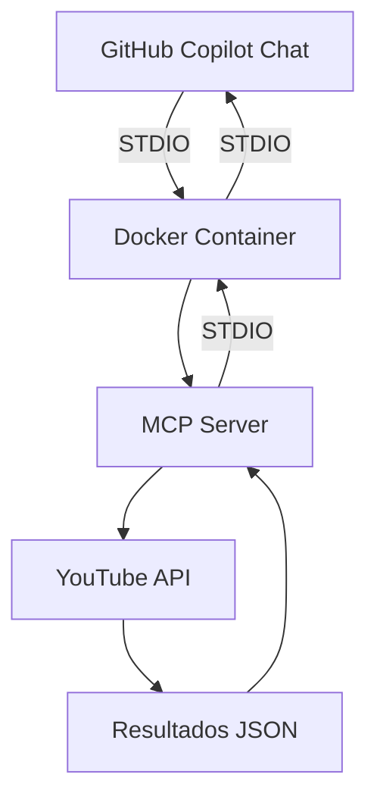

# MCP Server Dockerizado con STDIO ��🤖

¡Hola developer! 👋🏻 Este repositorio es mi laboratorio de experimentación para probar cómo implementar un **MCP Server completamente dockerizado** usando **STDIO como transporte**. 


## 🎯 Objetivo del Proyecto

En este branch estoy experimentando con la creación de un MCP Server que:
- ✅ **Se ejecute completamente en Docker**
- ✅ **Use STDIO como protocolo de transporte**
- ✅ **Sea compatible con GitHub Copilot Chat**
- ✅ **Permita búsquedas en YouTube**

## 📋 Agenda de Desarrollo

- [x] 🐳 Configurar Dockerfile base
- [x] 📡 Implementar transporte STDIO
- [x] 🔧 Configurar mcp.json para Docker
- [x] 🎥 Integrar API de YouTube
- [x] ✨ Herramientas de búsqueda de videos
- [x] 🎬 Herramientas de búsqueda de canales
- [ ] 🧪 Tests automatizados
- [ ] 📚 Documentación completa
- [ ] 🚀 Optimización de imagen Docker
- [ ] 🔒 Mejoras de seguridad

## 🛠️ Características Implementadas

- **🔍 Búsqueda de videos**: Busca videos en YouTube por término de búsqueda
- **📺 Búsqueda de canales**: Encuentra canales de YouTube por nombre
- **💬 Transporte STDIO**: Compatible con GitHub Copilot y otras herramientas MCP
- **🐳 Dockerizado**: Contenedor listo para producción

## 🔧 Herramientas Disponibles

### 1. 🎥 search_video
Busca videos en YouTube por término de búsqueda.

**Parámetros:**
- `q` (string): Término de búsqueda para el video

**Ejemplo de uso:**
```json
{
  "tool": "search_video",
  "arguments": {
    "q": "MCP Model Context Protocol tutorial español"
  }
}
```

### 2. 📺 get_youtube_channel
Busca un canal de YouTube por su nombre.

**Parámetros:**
- `query` (string): Nombre del canal de YouTube a buscar

**Ejemplo de uso:**
```json
{
  "tool": "get_youtube_channel",
  "arguments": {
    "query": "midudev"
  }
}
```

## ⚙️ Configuración del Proyecto

### 📦 Instalación Local
1. Clona el repositorio:
   ```bash
   git clone <tu-repo>
   cd mcp-github-copilot
   ```

2. Instala las dependencias:
   ```bash
   npm install
   ```

3. Crea un archivo `.env` basado en `.env.example`:
   ```bash
   cp .env.example .env
   ```

4. Añade tu YouTube API Key al archivo `.env`:
   ```env
   YOUTUBE_API_KEY=tu_api_key_aqui
   ```

## 🚀 Desarrollo y Ejecución

### 🔨 Compilar el proyecto
```bash
npm run build
```

### ▶️ Ejecutar el servidor localmente
```bash
npm start
```

### 👀 Modo desarrollo (compilación automática)
```bash
npm run dev
```

## 🐳 Docker - La Magia Acontece Aquí

### 🏗️ Construir la imagen Docker
```bash
docker build -t unified-mcp-server .
```

### 🚀 Ejecutar el contenedor
```bash
docker run --rm -i -e YOUTUBE_API_KEY=tu_api_key_aqui unified-mcp-server
```

### 🎯 ¿Por qué Docker con STDIO?

El enfoque dockerizado con STDIO tiene varias ventajas:
- 🔒 **Aislamiento**: El servidor corre en su propio contenedor
- 📦 **Portabilidad**: Funciona en cualquier sistema con Docker
- 🛡️ **Seguridad**: Variables de entorno aisladas
- 🎛️ **Control**: GitHub Copilot maneja el ciclo de vida del contenedor

## 🤖 Configuración con GitHub Copilot

Este es el corazón del experimento. La configuración en `.vscode/mcp.json` está diseñada específicamente para usar Docker con STDIO:

```json
{
    "servers": {
        "unified-mcp": {
            "type": "stdio",
            "command": "docker",
            "args": [
                "run",
                "--rm",
                "-i",
                "--env",
                "YOUTUBE_API_KEY=${input:youtube_api_key}",
                "unified-mcp-server"
            ]
        }
    },
    "inputs": [
        {
            "type": "promptString",
            "id": "youtube_api_key",
            "description": "YouTube API Key",
            "password": true
        }
    ]
}
```

### 🔍 Análisis de la Configuración

- **`type: "stdio"`**: Usa entrada/salida estándar para comunicación
- **`command: "docker"`**: Ejecuta Docker directamente
- **`--rm`**: Elimina el contenedor al finalizar
- **`-i`**: Modo interactivo para STDIO
- **`${input:youtube_api_key}`**: Solicita la API key de forma segura

## 🔑 Obtener API Key de YouTube

Para conseguir tu YouTube API Key sigue estos pasos:

1. 🌐 Ve a [Google Cloud Console](https://console.cloud.google.com/)
2. 📁 Crea un nuevo proyecto o selecciona uno existente
3. 🔌 Habilita la **YouTube Data API v3**
4. 🔐 Crea credenciales (API Key)
5. 📋 Copia la API Key y úsala en tu configuración

## 📁 Estructura del Proyecto

```
📂 mcp-github-copilot/
├── 🐳 Dockerfile              # Configuración de Docker
├── 🐙 docker-compose.yml      # Orquestación (opcional)
├── 📦 package.json            # Dependencias y scripts
├── ⚙️ tsconfig.json          # Configuración TypeScript
├── 📂 src/
│   ├── 🚀 index.ts           # Servidor MCP principal
│   └── 📂 tools/             # Herramientas del servidor
├── 📂 .vscode/
│   └── 🤖 mcp.json           # Configuración GitHub Copilot
├── 📂 mcp-remote/            # Implementación SSE (legacy)
└── 📂 mcp-stdio/             # Implementación STDIO local (legacy)
```

## 🏗️ Arquitectura del Experimento



## 🔬 Experimentos Previos

Este repositorio también contiene implementaciones anteriores que sirvieron como base:

### 📡 mcp-remote
- **Transporte**: SSE (Server-Sent Events)
- **Tecnología**: Express.js
- **Estado**: Legacy - Funcional pero no dockerizado

### 💻 mcp-stdio
- **Transporte**: STDIO
- **Ejecución**: Local con Node.js
- **Estado**: Legacy - Base para la versión dockerizada

## 🤔 ¿Qué es Model Context Protocol?

Model Context Protocol (MCP) es un protocolo estandarizado que permite a los modelos de lenguaje **interactuar con sistemas externos** de forma segura y estructurada. 

### 🔌 Analogía USB-C
Según la documentación oficial, MCP es como un **USB-C para la IA**:
- 🔗 **Conectividad universal**: Un solo protocolo para múltiples servicios
- 🚀 **Plug & Play**: Conexión simple sin configuraciones complejas
- 🛡️ **Estándares seguros**: Protocolos bien definidos

### 🏗️ Componentes del MCP

#### 🖥️ MCP Server
- **Función**: Implementa el protocolo y expone herramientas
- **Rol**: Intermediario entre el modelo y sistemas externos
- **Ejemplo**: Este proyecto dockerizado

#### 🤖 MCP Client
- **Función**: Consume los servicios del servidor
- **Ejemplos**: 
  - 💬 Claude Desktop
  - 🛠️ Visual Studio Code + GitHub Copilot Chat
  - 🔍 MCP Inspector

## 🧪 Probar el Servidor

### Con GitHub Copilot Chat (Recomendado)
1. 🏗️ Construye la imagen Docker
2. ⚙️ Configura `.vscode/mcp.json` 
3. 🔄 Reinicia VS Code
4. 💬 Pregunta a GitHub Copilot: "busca videos de MCP en español"

### Con MCP Inspector
Para testing rápido y debug:

```bash
npx @modelcontextprotocol/inspector
```

## 🎉 Resultados del Experimento

✅ **Exitoso**: Docker + STDIO + GitHub Copilot funcionan perfectamente juntos  
✅ **Ventajas**: Aislamiento, portabilidad y facilidad de distribución  
✅ **Aprendizaje**: La configuración con variables de entorno seguras es clave  

---

**¿Te interesa experimentar con MCP? ¡Clona este repo y comienza tu propio laboratorio! 🚀**
